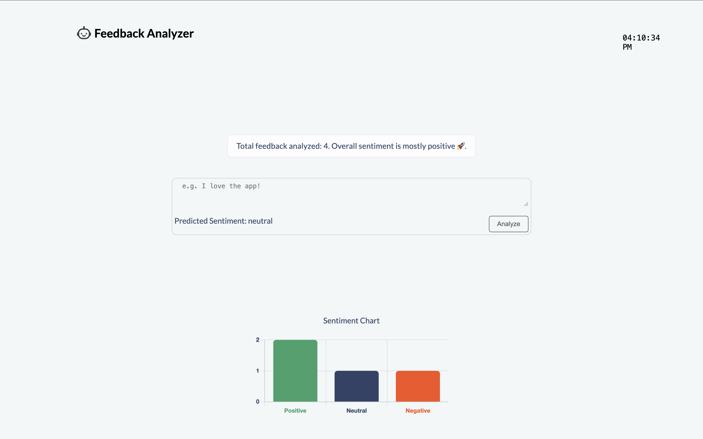
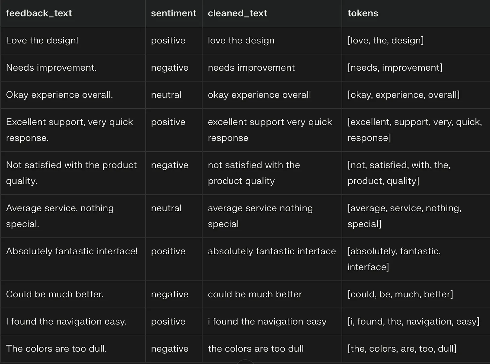

## AI-Powered User Insight Dashboard

This detailed hands-on cloud and AI engineering project.
We'll build a web dashboard that lets users submit feedback, stores it in the cloud, applies AI-based sentiment analysis, and displays results with easy-to-read graphs—all using AWS free-tier, Python, popular open-source libraries, and UX design principles.

## Screenshot



## Technologies Used

- Frontend: HTML, CSS, JavaScript,

- Serverless Backend: Python (AWS Lambda)

- Machine Learning: scikit-learn (Naive Bayes Classifier)

- Cloud: AWS S3, Lambda, API Gateway, SageMaker

- Data: CSV (user feedback + sentiment label)

## Implementation

### Step 1: Set Up AWS Cloud Resources

- Sign in to AWS Console.

- Create an S3 bucket (for storing your feedback CSV and model artifacts):

- Go to S3 service.

- Click "Create bucket", name it (e.g., your-username-feedback-data), and note the region.

- Create an IAM user with programmatic access and S3/SageMaker/Lambda rights (make sure you download the CSV file containing the access key and secret credentials).

- Install AWS CLI on your computer and configure credentials:

```bash
    aws configure
    # Enter your access key, secret, region, Output Format (e.g., AGHKJLK*(MKNHVG, ********98,  us-east-1, Json)
```

### Step 2: Prepare and Upload Your Data

- Gather sample user feedback data—create a simple CSV called feedback.csv (Example below):



- Save this file locally. Then upload it to your S3 bucket:

```bash
    aws s3 cp feedback.csv s3://your-username-feedback-data/
    #replace with the name of the S3 bucket we created earlier
```

### Step 3: Train a Sentiment Analysis Model on SageMaker

- In AWS, open the SageMaker service and launch a Notebook Instance (choose ml.t2.medium for free tier eligibility).

- Open Jupyter on the instance. Create a new Python 3 notebook.

- In a new cell, paste and run:

```python
    import pandas as pd
    from sklearn.model_selection import train_test_split
    from sklearn.feature_extraction.text import CountVectorizer
    from sklearn.naive_bayes import MultinomialNB
    import joblib
    import boto3

    # Download data from S3
    s3 = boto3.client('s3')
    s3.download_file('your-username-feedback-data', 'feedback.csv', 'feedback.csv')
    data = pd.read_csv('feedback.csv')

    # Preprocessing
    X = data['feedback_text']
    y = data['sentiment']
    vect = CountVectorizer()
    X_vect = vect.fit_transform(X)

    # Train model
    X_train, X_test, y_train, y_test = train_test_split(X_vect, y, test_size=0.2, random_state=42)
    clf = MultinomialNB()
    clf.fit(X_train, y_train)
    print('Model score:', clf.score(X_test, y_test))

    # Save model and vectorizer
    joblib.dump(clf, 'model.joblib')
    joblib.dump(vect, 'vectorizer.joblib')
    # Upload to S3 for Lambda
    s3.upload_file('model.joblib', 'your-username-feedback-data', 'model.joblib')
    s3.upload_file('vectorizer.joblib', 'your-username-feedback-data', 'vectorizer.joblib')
```

- This trains a basic sentiment model and uploads artifacts to S3.

### Step 4: Create a Lambda Function for Prediction

- In AWS, go to Lambda > Create Function > Author from scratch.

- Choose Python 3.8 runtime.

- Add S3 read access to the Lambda execution role.

- Use the Lambda editor to paste code below (simplified to load your model/vect from S3 and make predictions):

```python
   import boto3
import os
import joblib
import json

s3 = boto3.client('s3')
BUCKET = 'your-username-feedback-data'

# Lambda cold start: load model/vectorizer from S3 to /tmp
def load_artifacts():
    s3.download_file(BUCKET, 'model.joblib', '/tmp/model.joblib')
    s3.download_file(BUCKET, 'vectorizer.joblib', '/tmp/vectorizer.joblib')
    model = joblib.load('/tmp/model.joblib')
    vect = joblib.load('/tmp/vectorizer.joblib')
    return model, vect

model, vect = load_artifacts()

def lambda_handler(event, context):
    feedback = event['body']
    vect_text = vect.transform([feedback])
    prediction = model.predict(vect_text)[0]
    return {
        'statusCode': 200,
        'body': json.dumps({'sentiment': prediction})
    }
```

- Deploy a new Lambda Layer to package your model dependencies (joblib, scikit-learn). (See AWS docs; pre-built layers for scikit-learn are available.)

- Test in Lambda console with a sample event (e.g., {"body": "Great app!"}).

### Step 5: Make API Gateway Endpoint

- Open API Gateway > Create API > REST API.

- Define a new /predict POST endpoint, integrated with your Lambda function.

- Enable CORS (allows web calls from your dashboard site).

### Step 6: Build a Simple Frontend Dashboard or clone this repo (https://github.com/BrightDev10-Cloud/feedback-analyzer.git)

```bash
    <!DOCTYPE html>
    <html>
        <head><title>AI User Insight Dashboard</title></head>
        <body>
        <h2>Enter Feedback:</h2>
        <input type="text" id="feedbackInput" />
        <button onclick="analyze()">Analyze</button>
        <div id="result"></div>
        <script>
            async function analyze() {
            const input = document.getElementById('feedbackInput').value;
            const res = await fetch('https://YOUR-API-GATEWAY-URL/predict', {
                method: 'POST',
                headers: {'Content-Type': 'application/json'},
                body: input
            });
            const json = await res.json();
            document.getElementById('result').innerText = 'Predicted sentiment: ' + json.sentiment;
            }
        </script>
        </body>
    </html>
```

- Replace https://YOUR-API-GATEWAY-URL/predict with your deployed endpoint URL.
